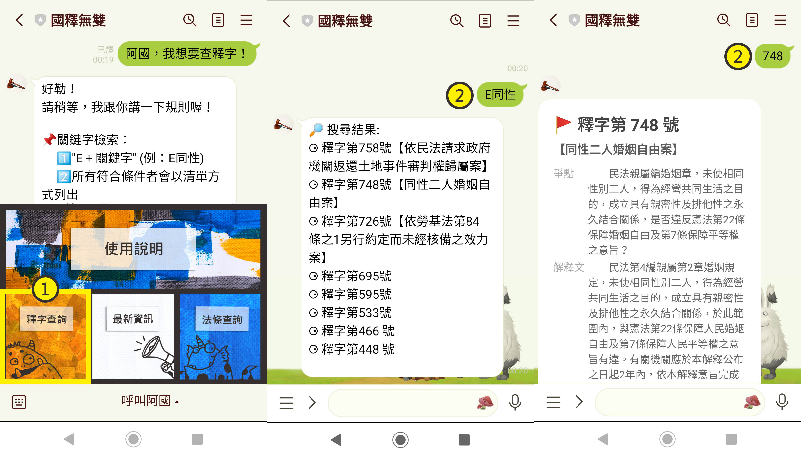
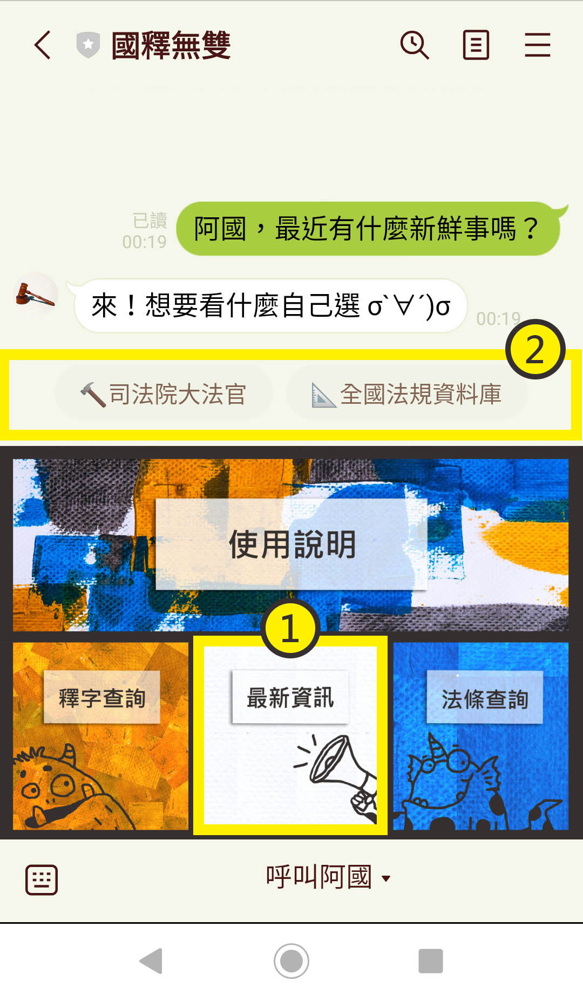

# 國釋無雙
## 釋字、法條查詢器人

### 👉介紹
> 釋字或法條更新了卻不知道嗎？ 
> 腦袋裡有關鍵字卻想不起來到底是哪個釋字或條號嗎？ 
> 不需要小六法，只需要打開手機，讓阿國來幫你！
* 查詢釋字
* 查詢法條
* 查最新資訊

### 👉加好友
* 機器人 ID：@935kvzlh
* QRcode

### 👉使用方式
#### 釋字查詢
* 點選選單中的「釋字查詢」
* 依據回傳的指示輸入欲查詢的關鍵字
  ** E + 關鍵字 (ex. E同性)
  ** 字號 (ex. 748) 

#### 法條查詢
* 點選選單中的「法條查詢」
* 選擇要查詢的法典 (憲法、民法、刑法、行政程序法)
* 依據回傳的指示輸入欲查詢的關鍵字
  ** K + 關鍵字 (ex. K民主)
  ** 條號 (ex. 1,15-20,22)
  *** 注意標點符號的格式均為半型
* 若欲改搜其他部法典，再重複前面的步驟即可

#### 最新資訊
* 點選選單中的「最新資訊」
* 選擇要前往的網站
  ** 司法院大法官
  ** 全國法規字料庫 

#### 使用說明
* 突然忘記規則可以看這裡
